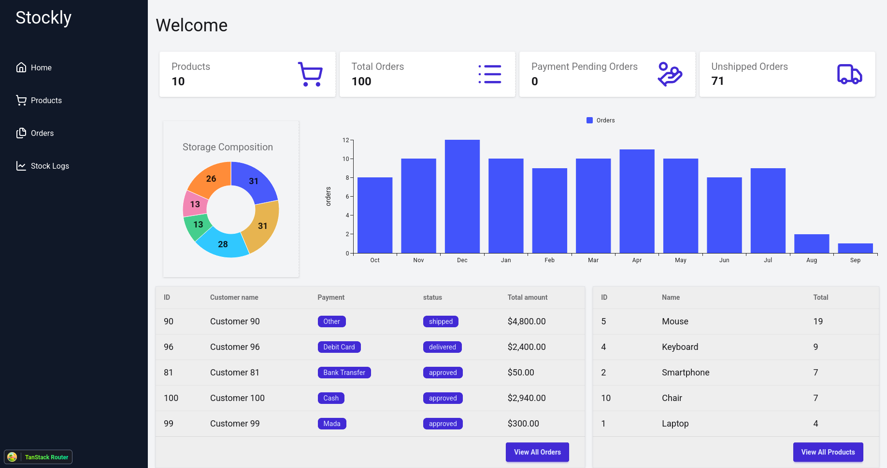
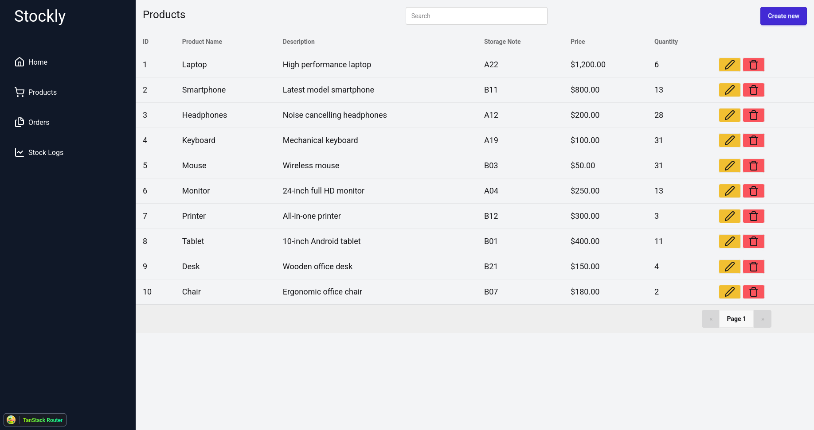
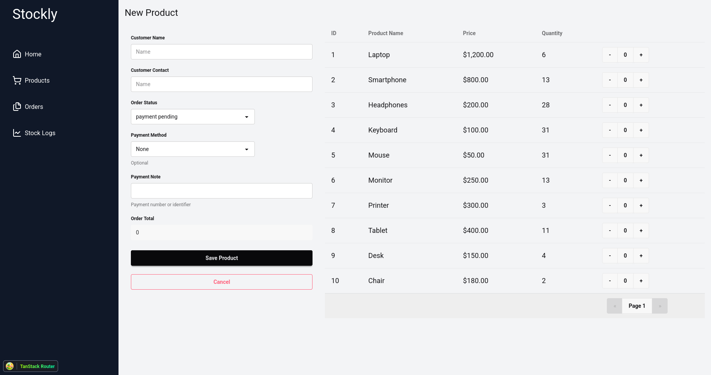

# 🧭 Stockly — Frontend

A modern inventory and order management dashboard built with **React**, **TypeScript**, and **TanStack Router**.  
Designed for small businesses and sellers to easily track products, stock levels, and sales activity in real-time.

---

## 🖼️ Preview


<br></br>

<br></br>

<br></br>


---

## 🚀 Tech Stack

- ⚛️ **React 19** + **TypeScript**
- 🧭 **TanStack Router** — file-based routing
- 🔁 **TanStack Query** — server state management
- 🔁 **TanStack Table** — building tables management
- 💾 **Axios** — API client
- 💅 **TailwindCSS** + **DaisyUI** — modern styling
- 🧩 **Jotai** — lightweight global state
- 🧱 **Lucide Icons** — crisp SVG icons

---

## ⚙️ Setup & Run

### 1️⃣ Clone the repository

```bash
git clone https://github.com/yourusername/stockly_client.git
cd stockly_client
````

### 2️⃣ Install dependencies

```bash
npm install
# or
pnpm install
```

### 3️⃣ Run the development server

```bash
npm run dev
```

### 4️⃣ Build for production

```bash
npm run build
```

---

## 📦 Folder Structure

```
stockly_client/
│
├── src/
│   ├── components/       # Shared UI components (Drawers, Tables, etc.)
│   ├── routes/           # Pages and layouts (using TanStack Router)
│   ├── services/
│   │   ├── api/          # API calls (Axios)
│   │   └── tables/       # TanStack Table column configs
│   ├── state/            # Jotai atoms (global state)
│   └── main.tsx          # Entry point
│
├── public/               # Static assets
├── docs/images/          # Screenshots for README
├── package.json
└── vite.config.ts
```

---

## 🔄 Environment Variables

Create a `.env` file in the root directory:

```bash
VITE_API_URL=http://app_api_url/api
```

---

## 🧰 Features

✅ Product Management
✅ Order Tracking
✅ Stock Analytics Dashboard
✅ Search and Filtering
✅ Pagination and DataGrid Integration
✅ Real-time UI Updates via React Query

---

## 🧑‍💻 Developer Notes

- Uses **React Query** for efficient data fetching and caching.
- Fully **typed** with TypeScript for safety and scalability.
- Built using **Vite** for fast dev server and optimized builds.

---

## 📜 License

This project is licensed under the **MIT License**.

---

**Author:** Talal
📧 Contact: [[talalbalnoob@gmail.com](mailto:talalbalnoob@gmail.com)]
